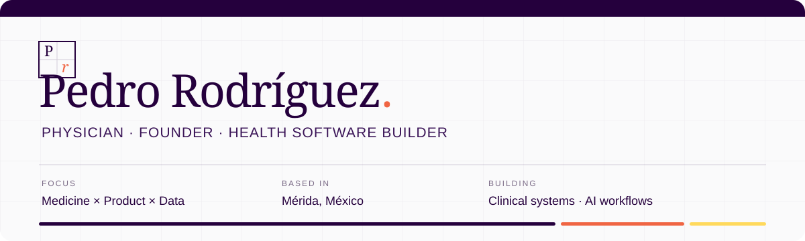

  

I am a physician who works across **clinical reasoning, product architecture, software engineering and data**. I turn healthcare and operational problems into structured systems, reliable workflows and decision-support tools.

My work is shaped by a simple principle: technology in healthcare should be **useful, understandable and worthy of trust**.

  
  
  
  

---

## `01 /` Current focus

- Founding and directing private healthcare software products.
- Translating clinical workflows into product and engineering requirements.
- Building reproducible data and AI-assisted research pipelines.
- Improving software quality through testing, access control, documentation and security review.
- Connecting clinical judgment with analytics and product strategy.

---

## `02 /` Products I lead

### Sinthia — Private clinical software product

**Founder · Product Owner · Lead Architect** &nbsp; `Private development`

I conceived and own Sinthia, a private software product designed around real-world clinical workflows. I define its product vision, clinical requirements and architectural direction while leading a multidisciplinary development team.

My responsibilities include prioritizing the roadmap, translating clinical needs into technical requirements, reviewing architectural decisions, approving significant changes, and overseeing product quality, security and release readiness.

`Healthcare software` · `Product architecture` · `Clinical workflows` · `Team leadership`

> Product mechanics, clinical logic, system architecture and source code are intentionally undisclosed.

### ELUN — Healthcare professional community

**Founder · Product Creator · Product Lead** &nbsp; `Private development`

I originated ELUN and lead its development as a dedicated digital product for healthcare professionals. I am responsible for the product concept, strategic direction, clinical positioning and overall experience.

I coordinate the team's work, define product requirements, evaluate design and technical proposals, and retain final responsibility for roadmap and product decisions.

`Digital health` · `Product strategy` · `Community design` · `Trust and safety`

> Identity systems, collaboration mechanics, AI workflows and business strategy remain confidential.

---

## `03 /` Selected technical work

### Technical audit — AI-assisted medical education platform

**Independent Technical Auditor · Solution Architect** &nbsp; `Third-party platform`

Conducted a pre-engagement technical assessment of an AI-assisted educational platform developed by a third party. Evaluated its prototype architecture, operational risks, security posture and readiness for continued development.

Produced a modernization proposal covering maintainability, data handling, security controls and phased implementation.

`Technical audit` · `AI prototypes` · `Security review` · `Architecture planning`

> Assessment and proposal only. Implementation has not formally commenced, and client-identifying details are withheld.

### BTC Analysis — Orchestrated market evidence pipeline

**Creator · Data Workflow Architect** &nbsp; `Controlled case study`

Designed a reproducible research workflow that collects, validates and packages multi-source evidence for structured Bitcoin market analysis. The system coordinates specialized processing stages, applies automated quality checks and produces portable evidence bundles for downstream analysis.

`Python` · `Deepnote` · `Data orchestration` · `Quality validation` · `Automation`

> Data sources, calculated signals, thresholds, prompts and decision rules remain private. A sanitized technical overview is in preparation.

---

## `04 /` Selected public work

| Project | What it demonstrates | Core tools |
|---|---|---|
| [**PedroRodriguez.me**](https://github.com/PedroRgz/pedrorodriguez.me) | Personal portfolio with an editorial design system and responsive interface. | React · JavaScript · CSS |
| [**Episcopio**](https://github.com/PedroRgz/Episcopio) | A social-media analytics MVP designed around an API and cloud deployment. | Python · API · Azure · Docker |
| [**Breast cancer risk factors**](https://github.com/PedroRgz/Risk-Factors-for-breast-cancer-in-cuban-population) | Epidemiological analysis connecting medical reasoning with reproducible data work. | Python · Epidemiology · Data analysis |
| [**SpaceX launch analysis**](https://github.com/PedroRgz/CareerAcademy-IBM-DS-RocketLaunchesAnalysis) | End-to-end exploration, feature engineering and predictive modeling. | Python · SQL · Scikit-learn · Folium |
| [**Missing-data course**](https://github.com/PedroRgz/Curso-Manejo-de-datos-faltantes) | Reproducible notebooks and practical decision frameworks for incomplete datasets. | Pandas · Jupyter · Methodology |
| [**Earth iOS AR**](https://github.com/PedroRgz/Earth-iOS-AR) | An augmented-reality experiment built for iOS. | Swift · ARKit · iOS |

---

## `05 /` Practice and toolkit

| Product & engineering | Data & AI | Clinical & research |
|---|---|---|
| Product architecture | Python · Pandas · NumPy | Clinical workflow modeling |
| Requirements and roadmaps | SQL · PostgreSQL | Evidence appraisal |
| Git · GitHub Actions | Scikit-learn · MLflow | Epidemiological reasoning |
| Automated testing | Plotly · Matplotlib | Structured clinical documentation |
| Azure · Heroku · Docker | Jupyter · Deepnote | Interdisciplinary communication |
| Security and access control | Agentic workflows and automation | Healthcare product strategy |

I hold an **M.D. from Universidad Autónoma de Yucatán**, the **IBM Data Science Professional Certificate**, and **Microsoft Certified: Azure Fundamentals**.

---

## `06 /` How I work

I treat product and engineering decisions as hypotheses to test. That means making assumptions explicit, documenting trade-offs, validating data, reviewing changes carefully and designing for the people who will actually use the system.

I am especially interested in roles and collaborations where **clinical insight, data and product ownership** need to coexist.

---

## `07 /` Contact

- Portfolio: [pedrorodriguez.me](https://www.pedrorodriguez.me)
- LinkedIn: [linkedin.com/in/pedro-rgz](https://www.linkedin.com/in/pedro-rgz/)
- Kaggle: [kaggle.com/pedrorgz](https://www.kaggle.com/pedrorgz)
- Email: [pedro.rodriguez.g@icloud.com](mailto:pedro.rodriguez.g@icloud.com)

Designed and built with care in Mérida, México.

